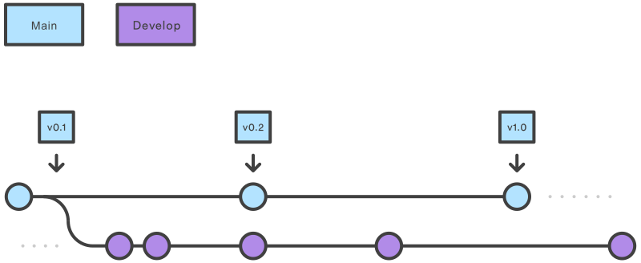

 

# Pexon Consulting GmbH - Contribution Guidelines

# Table of contents

<!--TOC-->

- [Pexon Consulting GmbH - Contribution Guidelines](#pexon-consulting-gmbh---contribution-guidelines)
- [Table of contents](#table-of-contents)
  - [1 Einführung](#1-einführung)
  - [2 Git Repository](#2-git-repository)
    - [2.1 Readme Datei](#21-readme-datei)
    - [Projekt Name](#projekt-name)
      - [Projektbescheibung](#projektbescheibung)
      - [Badges](#badges)
      - [Quickstart-Guide](#quickstart-guide)
      - [Link zu weiteren Ressourcen](#link-zu-weiteren-ressourcen)
      - [Acknowledgements](#acknowledgements)
      - [Kontaktdaten](#kontaktdaten)
    - [2.2 Git Branching-Strategie](#22-git-branching-strategie)
      - [2.2.1 Haupt-Branches](#221-haupt-branches)
      - [2.2.2 Feature Branches](#222-feature-branches)
      - [2.2.3 Release Branches](#223-release-branches)
      - [2.2.4 Hotfix Branches](#224-hotfix-branches)
    - [2.3 Releases und Versionierung](#23-releases-und-versionierung)
      - [2.3.1 Releases](#231-releases)
      - [2.3.2 Versionierung](#232-versionierung)
    - [2.4 `.gitignore`-Datei](#24-gitignore-datei)
    - [2.5 Issues und Issue-Templates](#25-issues-und-issue-templates)
      - [2.5.1 Issues](#251-issues)
      - [2.5.2 Templates](#252-templates)
  - [3 Source Code und Code Commits](#3-source-code-und-code-commits)
    - [3.1 Source Code Quality \& Style](#31-source-code-quality--style)
    - [3.2 Code Commits](#32-code-commits)
    - [3.3 Merges und Rebases](#33-merges-und-rebases)
    - [3.4 Pull Requests](#34-pull-requests)
    - [3.5 Lizenz](#35-lizenz)
    - [3.6 Code Coverage](#36-code-coverage)
  - [4 API Entwicklung](#4-api-entwicklung)
    - [4.1 Einleitung](#41-einleitung)
    - [4.2 API Design](#42-api-design)
      - [4.2.1 API Anfragen](#421-api-anfragen)
      - [4.2.2 API Antworten](#422-api-antworten)
      - [4.2.3 API Dokumentation](#423-api-dokumentation)
  - [5 Quellen](#5-quellen)

<!--TOC-->

## 1 Einführung

Alle Pexonians sind herzlich eingeladen, interessante Open-Source Projekte zu gestalten und diese in unserer GitHub Organisation zu veröffentlichen.
Pexon strebt danach, fesselnde Technologien zu kreieren, einzusetzen und zu fördern.

Die Pexon Consulting GmbH spezialisiert sich auf die IT Beratung & Entwicklung für die Bereiche Cloud, DevOps und Data.
Wir sind in ganz Deutschland vertreten – mit Standorten in Frankfurt, Eschborn, München, Berlin, Magdeburg und Hamburg.
Unser Ziel ist es, sämtliche Entwickler zu unterstützen und zu ermutigen, Neues zu schaffen.
Dafür wollen wir der Entwickler-Community unsere Tools und Projekte bereitstellen, welche wir selbst nutzen und aufbauen.

Dieses Dokument fungiert als Richtlinie für unsere Code-Qualität und die Struktur unserer Repositories.
Es soll die Zusammenarbeit während der Entwicklung erleichtern und die Veröffentlichung der Projekte auf einen einheitlichen Standard bringen.
Projekte können eigenständige Programme, Frameworks, Libraries, Plugins, Extentions, Dokumente und vieles weiteres sein.
Im folgenden werden diese, zur Vereinfachung, unter dem Begriff "Projekt" zusammengefasst.

## 2 Git Repository

### 2.1 Readme Datei

Die Readme-Datei ("README.md") stellt eines der wesentlichsten Dokumente innerhalb eines Git-Repositories dar, dieses Dokument sollte die wesentlichen Informationen zum Projekt enthalten.
Es sollte nicht das Hauptziel sein, dass die Readme-Datei die gesamte Dokumentation widerspiegelt.
Trotzdem sollte sie genügend Wissen vermitteln, um die meisten Fragen der Entwicklergemeinschaft zu beantworten.

***Folgende Punkte müssen in der Readme Datei zu finden sein:***

### Projekt Name

#### Projektbescheibung

Am Anfang der Readme-Datei befindet sich eine knappe Zusammenfassung, die als "Executive Summary" für das Projekt und das Repository fungiert.
In nur wenigen Sätzen soll der Leser einen groben Überblick darüber erhalten, worum es bei dem Projekt geht und welche Inhalte in diesem Repository zu finden sind.

#### Badges

An zweiter Stelle sollten Projekt-Badges ("Shields") zu finden sein.
Dieses Badges geben einen Überblick über verschiedene Attribute des Repositories geben.
Zu diesen Badges gehören unter anderem:

- Code Coverage
- Build Status
- Latest Version
- Code Lizenz

Shields können über den Folgen Links generiert werden: [shields.io](https://shields.io/)

#### Quickstart-Guide

Der Quickstart-Guide stellt eines der zentralen Elemente innerhalb der Readme-Datei dar.
Er umreißt die Schritte, die ein Nutzer befolgen muss, um das Projekt usw. nutzen zu können.
Bei der Erstellung des Quickstart-Guides ist es von besonderer Bedeutung, die Perspektive des Nutzers einzunehmen.
Das bedeutet, der Verfasser des Leitfadens sollte sich in die Lage einer Person versetzen, die noch keinerlei Interaktion mit dem Code hatte und bei Null beginnt.
Folglich müssen klare Informationen bereitgestellt werden, wie das Projekt genutzt werden kann, welche Vorbedingungen erfüllt sein müssen, ob spezifische Konfigurationen angepasst werden müssen und so weiter.
Idealerweise mündet der Leitfaden in einem "Hello World!"-Beispiel. Das bedeutet, er sollte so weit gehen, bis der Nutzer das Projekt usw. gestartet hat und ein einfaches Ergebnis sieht.

#### Link zu weiteren Ressourcen

In diesem Abschnitt der Readme sollen weiteren Ressourcen verlinkt werden, welche die Nutzung des Projekts unterstützen.
Dazu gehören unter anderem Verweise zu einer Wiki oder eine Demo.

#### Acknowledgements

Anerkenntnisse jeglicher Form haben hier ihren Platz.
Dazu gehören Punkte wie Danksagungen an wichtige Contributor, Sponsoren, usw.

#### Kontaktdaten

Hier einen Verweis mit dem Nutzer and Hilfe kommen können, wenn sie diese benötigen. Dies kann eine E-Mail (nicht empfohlen) oder ein Link zur Issue Page sein.

### 2.2 Git Branching-Strategie

Repositories folgen dem [Gitflow Workflow](https://www.atlassian.com/git/tutorials/comparing-workflows/gitflow-workflow).  
Det Gitflow Workflow sieht zwei Branches vor, welche die Projekt-Historie dokumentieren, den `main`-Branch und den `develop`-Branch (kurz `dev`), und weiteren Nebenbranches, welche von einem der beiden Hauptbranches abgeleitet werden und verschiedenen Nutzen haben.

Zusammenfassung der Branches:  

| Branch | Geschützt | Parent   | Beschreibung                                                                                                        |
|-----------|--------|----------|---------------------------------------------------------------------------------------------------------------------|
|  Main     |  Ja    |  /       |  Stable Branch mit aktuellster Version, "was gerade in Produktion läuft". Beinhaltet gekürzte Commit-Historie.      |
|  Dev      |  Ja    |  Main    |  Unstable Branch mit neusten Features.                                                                              |
|  Feature  |  Nein  |  Dev     |  Branch auf dem ein neues Feature entwickelt wird.                                                                  |
|  Release  |  Nein  |  Dev     |  Branch auf dem eine mehrzahl von neuen Features release-fertig gemacht werden.                                     |
|  bugfix   |  Nein  | release  |  Sollten Bugs in Release Branches auftreten sind sie mit Hilfe eines Bugfix Branches zu fixen                       |
|  Hotfix   |  Nein  |  Main    |  Branch auf welchem ein kritischer Fehler schnell behoben wird.                                                     |

#### 2.2.1 Haupt-Branches



Der `main`-Branch dient als Historisierung für alle Releases.  
Mit Ausnahme vom `dev`-Branches und von `hotfix`-Branches werden keine Branches vom `main`-Branch abgeleitet.
Jeder Commit auf den `main`-Branch zählt als neue stable-Version und wird zu einem neuen Release.  
Deshalb besitzt der `main`-Branch nur eine gekürzte Commit-History.
Alle Releases besitzen eine Release-Nummer. Mehr zu Release-Nummer und Versionierung in Kapitel [2.3.2](#232-versionierung).  

Der `dev`-Branch beinhaltet die komplette Commit History des Projektes und gilt aus Ausgangspunkt für die aktive Entwicklung.  
Jeder Branch außer `main` und `hotfix` vom `dev`-Branch abgeleitet.  

Beide Branches sind schreibgeschützt und können nur via Pull Requests modifiziert werden.
Weitere Informationen über Pull Requests in Kapitel [3.4 Pull Requests](#34-pull-requests)

#### 2.2.2 Feature Branches

Jedes entwickelte Feature sollte in einem eigenen Branch entwickelt werden, welcher vom `dev`-Branch abgeleitet wurde.  
Ist die Entwicklung fertig, wird der `feature`-Branch  zurück in den `dev`-Branch gemerged.  
`feature`-Branches dürfen niemals mit dem `main`-Branch direkt interagieren.


#### 2.2.3 Release Branches

Wenn der `dev`-Branch genug neue Features besitzt um einen neuen release zu erstellen wird ein `release`-Branch erstellt.  
Nach dem Erstellen eines `release`-Branches werden keine weiteren neuen Features in den `dev`-Branch hinzugefügt.  
Nur bugfixes, Dokumentation und andere Release-Relevante Sachen können hinzugefügt werden.


Sobald ein Release fertig ist wird dieser auf `main` und `develop` gemerged und mit einer Versionsnummer getagged.  
Nach dem mergen ist de Release-Branch zu löschen.  

#### 2.2.4 Hotfix Branches

`hotfix`-Branches können genutzt werden um kritische Fehler in stable-Releases schnell zu beheben.  
Ein `hotfix`-Branch wird vom `main`-Branch abgeleitet und kann nur Änderungen behinhalten die direkt zur Fehlerbehebung benötigt werden.  
Sobald der Fehler behoben wurde muss der `hotfix`-Branch in den `main`-, `develop`- und ggf. in den aktuellen `release`-Branch gemerged werden.  
Nach dem mergen ist der neue `main`-Branch mit einer neuen Version zu taggen und der `hotfix`-Branch muss gelöscht werden.  


### 2.3 Releases und Versionierung

Ein gleichbleibendes Releasemanagement und geordnete Versionierung helfen eine bessere Übersicht zu erschaffen und die "Dependency Hell" zu minimieren.  
Somit gelten für diese Punkte auch einige Regeln.

#### 2.3.1 Releases

Siehe Kapitel [2.2 Git Branching-Strategie](#22-git-branching-strategie) für weitere Informationen für das generelle Vorgehen und die Nomenklatur von Release-Branches.  

Ein Release-Workflow funktioniert wie folgt:

1. Merge `main` in `dev` um sicherzustellen das der `dev` den produktiven Code besitzt. Dies kann Merge-Konflikte vorbeugen, wenn etwa ein Hotfix nur auf `main` und nicht auf `dev` gemerged wurde.  

```text
git checkout dev
git merge master
```

2. Erstelle einen neuen `release`-Branch von Develop

````text
git checkout -b release-vX.Y.Z
git push --set-upstream origin release-vX.Y.Z
````

3. Falls nötig, behebe bugs im `release`-Branch

````text
$ git checkout release-vX.Y.Z
$ git checkout -b hotfix/<name>
$ git push --set-upstream hotfix/<name>
<Behebe Fehler>
$ git commit -m "<commit nachricht>"
$ git push
````

4. Wenn der Release fertig ist, eröffne eröffne einen neuen PR in Github

5. Sobald der PR gemerged wurde kann ein neuer Release erstellt werden mit den folgenden Daten:
    - Tag Version: `vX.Y.Z`
    - Target: `main`
    - Release Titel: `Release v.X.Y.Z`
    - Description: High Level Beschreibung der wichtigsten Änderungen

6. Merge `release`-Branch in den `dev`-Branch

7. Lösche den `release`-Branch

#### 2.3.2 Versionierung

Stabile Releases (Releases vom `main`-Branch) folgen der standard [Semver](https://semver.org/)-Konvention `MAJOR.MINOR.PATCH`
Dabei stehen `MAJOR`, `MINOR` und `PATCH` für positive Ganzzahlen und dürfen keine vorstehende "0" haben.
Inkrementiere ...

- ... MAJOR, bei breaking changes.
- ... MINOR, bei non-breaking changes.
- ... PATCH, bei non-breaking bug fixes.

### 2.4 `.gitignore`-Datei

Eine .gitignore-Datei ist eine Konfigurationsdatei in einem Git-Repository, die angibt, welche Dateien und Verzeichnisse von Git ignoriert werden sollen.  
Wenn eine Änderungen an deinem Code oder deinem Projekt vorgenommen wird und diese in einem Git-Repository verfolgst, gibt es oft Dateien oder Verzeichnisse, die automatisch generiert werden oder temporäre Daten enthalten, die nicht im Repository gespeichert werden sollen.  
Diese könnten beispielsweise Kompilierungsresultate, temporäre Dateien, Logdateien, Konfigurationsdateien mit vertraulichen Informationen oder andere lokale Konfigurationen sein.  

Die .gitignore-Datei ermöglicht es, diese Dateien und Verzeichnisse zu spezifizieren, sodass Git sie beim Commit und der Versionsverwaltung ignoriert.  
Dadurch wird verhindert, dass unnötige oder sensible Daten im Repository gespeichert werden.  
Die .gitignore-Datei enthält Muster und Pfade zu den Dateien und Verzeichnissen, die ausgeschlossen werden sollen.

Die Syntax der .gitignore-Datei ermöglicht die Verwendung von Wildcards und regulären Ausdrücken, um verschiedene Dateitypen oder Muster von Dateinamen zu erfassen.
Sie ist somit ein nützliches Werkzeug, um dein Repository sauber zu halten und sicherzustellen, dass nur die relevanten Dateien und Verzeichnisse im Versionskontrollsystem verfolgt werden.

Ein Projekt sollte immer eine `.gitignore`-Datei besitzen, die auf das Projekt angepasst ist.
Ein Template kann sich mit Github beim Erstellen eines leeren Repositories automatisch generieren lassen.
Alternativ biete [diese](https://github.com/pexon-consulting/github-code-repository-guidelines/blob/main/.gitignore) `.gitignore`-Datei einen guten Startpunk.

### 2.5 Issues und Issue-Templates

#### 2.5.1 Issues

Bugs und Features müssen über Github Issues vorgeschlagen werden.
Sollte ein Issue für mehr als 90 Tage keine neues update bekommen gibt es als Inaktiv und muss geschlossen werden.
Dafür lassen sich automatisch Github Actions erstellen.
Ein respektvoller und sachlicher Umgang miteinander innerhalb der Issue-Diskusion ist hierbei selbstverständlich Pflicht.

#### 2.5.2 Templates

Das einrichten von Templates für Bugs und Features hilft die Angelegenheiten einfacher zu erklären und zu verstehen.
Templates müssen pro Repository eingerichtet werden.
Dabei bietet Github selbst vorgefertigte Templates, welche in den meisten Fällen ausreichen.
Bei bedarf können die Templates zu jedem Zeitpunkt geändert werden.
Das Einrichten der Templates funktioniert wie folgt:

  1. Auf der Repository Startseite, navigiere zu "Settings"
  2. Unter "General", scrolle etwas weiter runter zum Kasten "Features"
  3. Aktivere ein Eintrag "Issues"
  4. Klicke auf den grünen Button "Set up Templates"
  5. Im Dropdown Button "Add Template" wähle das gewünschte Template aus. Hier kann zwischen "bug report", "Feature request", und "Custom Template" ausgewählt werden.
  6. Optional: Überprüfe das Template und führe ggf. Änderungen durch.
  7. Klicke auf "Propose Changes"
  8. Im sich nun öffnenden Abschnitt, füge eine passende Commit-Nachricht hinzu.
  9. Wähle die Option einen neuen Branch und PR zu erstellen
  10. Klicke auf "Commit changes"

## 3 Source Code und Code Commits

Dieser Abschnitt listet das Regelwerk auf, welches von jedem Entwickler eines Projektes in dieser Organisation zu befolgen ist.

### 3.1 Source Code Quality & Style

***Als grundsätzliche Regelt gilt: Für jede Programmiersprache sind die "Best Practices" der entsprechenden Sprache einzuhalten.***

Hier eine Referenz zu den Best Practices verschiedener Sprachen:

**Java**: [Google Java Style Guide](https://google.github.io/styleguide/javaguide.html)
**Python**: [PEP 8 Style Guide](https://peps.python.org/pep-0008/), [Google Python Style Guide](https://google.github.io/styleguide/pyguide.html), [The Hitchhiker's Guide to Python](https://docs.python-guide.org/)
**JavaScript**: [JavaScript: The Right Way](http://jstherightway.org/), [Google JavaScript Style Guide](https://google.github.io/styleguide/jsguide.html), [W3C Javascript Best Practices](https://www.w3.org/wiki/JavaScript_best_practices)
**TypeScript**: [AWS Follow TypeScript best practices](https://docs.aws.amazon.com/prescriptive-guidance/latest/best-practices-cdk-typescript-iac/typescript-best-practices.html), [Typescript Do's and Don'ts](https://www.typescriptlang.org/docs/handbook/declaration-files/do-s-and-don-ts.html)
**HTML**: [HTML Style Guide](https://www.w3schools.com/html/html5_syntax.asp)
**CSS**: [Organizing your CSS](https://developer.mozilla.org/en-US/docs/Learn/CSS/Building_blocks/Organizing)
**GoLang**: [Effective Go](https://go.dev/doc/effective_go), [GoLang best Practices](https://golangdocs.com/golang-best-practices)

Weitere Guides zu diesen und weiteren Sprachen, Frameworks und Tools sind zu finden im folgenden Repository: [Awesome Guidelines](https://github.com/Kristories/awesome-guidelines)

### 3.2 Code Commits

Commit Titel müssen kurz und kompakt sein. Dabei müssen sie die wichtigsten Changes im Commit nennnen.
Commit Beschreibungen dürfen tiefer ins Detail gehen.
Commit Beschreibungen sind optional aber empfohlen.
Commit Titel und Beschreibungen dürfen entweder Deutsch oder Englisch sein, jedoch muss pro Branch eine Sprache eingehalten werden.
Sowohl Titel als auch Beschreibung werden im Imperativ geschrieben.

Alle Nachrichten folgen dem Schema:

    <ticket_nr>: <Commit_Titel>

    <Commit_Beschreibung>

### 3.3 Merges und Rebases

Um eine saubere Commit History zu gewährleisten dürfen Changes von anderen Branches nur mit dem `git merge` oder dem `git rebase` Befehl eingefügt werden. Dabei darf nur eine der beiden Methoden genutzt werden.
Dem Branch-Owner ist überlassen welche der beiden genutzt wird.
Weitere Informationen: Siehe [Merging vs. Rebasing](https://www.atlassian.com/git/tutorials/merging-vs-rebasing)

Beim Merge auf den `main`-Branch via PR müssen die Commits auf dem eingehenden Branch mit dem `git squash`-Befehl oder per IDE komprimiert werden.
Weitere Informationen: Siehe [Git Squash Commits](https://www.baeldung.com/ops/git-squash-commits)

### 3.4 Pull Requests

Ein Pull Request muss von mindest einem weiteren Contributor oder Code-Owner gereviewed werden.  
Beim erstellen eines PRs muss ein Template verwendet und ausgefüllt werden. Entsprechende Templates müssen dafür im jeden Repository bereitstehen.  
Templates sind als Markdown-Datei (`.md`) anzulegen und können in dem Ordner `.github/PULL_REQUEST_TEMPLATE` hinterlegt werden.

### 3.5 Lizenz

Für unsere Open Source Projekte wird Grundsätzlich die [GPL3 Lizenz](https://www.tldrlegal.com/license/gnu-general-public-license-v3-gpl-3) genutzt.  
Diese ist in jeder Codebase beizulegen.  
Abweichende Lizenzen sind je nach Projekt aus verschiedenen Gründen auch nutzbar.

### 3.6 Code Coverage

Code coverage beschreibt die prozentuale Menge an Codezeilen, welche durch Tests abgedeckt werden.
Auch wenn eine hohe Coverage-Rate nicht automatisch stabiles, bug freien Code garantiert, ist sie trotzdem ein guter Indikator über den generellen Stand einer Test-Suite.
Für die gesamte Code-Basis gilt eine Mindestrate von 80% Coverage, empfohlen wird 90%.
Für Breaking Changes ist die Mindestrage 90%.
Folgende Art von Code zählt nicht in die Coverage rein:

- Pure Datenklassen wie Java-Beans, oder structs
- Generierte Dateien wie etwas durch pre-processors (Lombok, OpenAPI, Kafka)
- Boilderplate Methoden (Getters, Setters, pure Constructors)
- Kommentare
- Whitespaces

Mit Tools wie SobarQube lassen sich Coverage Ziele und Ausnahmen definieren.

## 4 API Entwicklung

### 4.1 Einleitung

Dieses Kapitel richtet sich an API-Projekte und erklärt einige Richtlinien an die sich bei der Entwicklung gehalten werden muss.
Spezifisch werden hier REST-APIs für Web-Anwendungen beschrieben.

### 4.2 API Design

Das Design API sollte den üblichen API Best-Practices entsprechen.

#### 4.2.1 API Anfragen

API URLs nutzen `kebab-case`.
URL Parameter nutzen `camelCase`.
URL Pfade die eine Sammlung ansteuern nutzen den Plural des Resourcennamens (Beispiel: `/users` anstatt `/user`).
HTTP Verben beschreiben die grundsätzliche Funktion der API-Operation.
Vermeide URL Pfade mit mehr als einem Parameter. Verwende stattdessen `QueryParameter`.
Der Request- und Response-Body sollte der standard JSON-Konvention entsprechen.
Vermeide Verben für URL Pfade die Ressourcen ansprechen, nutze stattdessen Nomen.
Nutze Verben für Non-Ressourcen.

| **VERB** | **Beschreibung**                                          |
| -------- | --------------------------------------------------------- |
| GET      | Genutzt um eine einzelne Resource abzurufen               |
| POST     | Genutzt um eine neue Resource oder Sub-Resource anzulegen |
| PUT      | Genutzt um eine existierende Resource zu updaten          |
| PATCH    | Genutzt um eine existierende Resource zu updaten          |
| DELETE   | Genutzt um eine existierende Resource zu löschen          |

#### 4.2.2 API Antworten

Eine API sollte immer eine Antwort geben, unabhängig vom Erfolg oder Qualität der Anfrage.
Dabei enthalten die Antworten immer einen HTTP-Status Code der die Antwort am bestmöglichen Beschreibt.

Weitere Informationen zu den Status Codes sind hier zu finden: [MDN HTTP Status Codes](https://developer.mozilla.org/en-US/docs/Web/HTTP/Status)

#### 4.2.3 API Dokumentation

Die API sollte mit der OpenAPI Spezifikation entsprechen und mit industrieüblichen Tools wie Swagger dokumentiert werden.
Dabei sollte die Dokumentation entsprechende Beispiele beinhalten die eine Anfrage und eine Antwort exemplarisch darstellen.
Wenn dies technisch nicht umsetzbar ist kann diese Regel ausgelassen werden.
Generell sollte jeder API-Endpunk die folgende Dokumentation besitzen:

- Jeder URL Parameter soll spezifiziert und als "erforderlich" oder "optional" gekennzeichnet sein.
- Wenn der Request-Typ "POST" ist, sollte ein funktionierendes Beispiel angefügt werden.
- Eine erfolgreiche Antwort sollte beispielhaft angefügt sein.
- Potentielle Fehlernachrichten sollten angefügt sein.

## 5 Quellen

- [elsewhencode/project-guidelines](https://github.com/elsewhencode/project-guidelines)
- [Kristories/awesome-guidelines](https://github.com/Kristories/awesome-guidelines)
- [Swagger best Practices in API Design](https://swagger.io/resources/articles/best-practices-in-api-design/)
- [Configuring issue templates for your repository](https://docs.github.com/en/communities/using-templates-to-encourage-useful-issues-and-pull-requests/configuring-issue-templates-for-your-repository)
